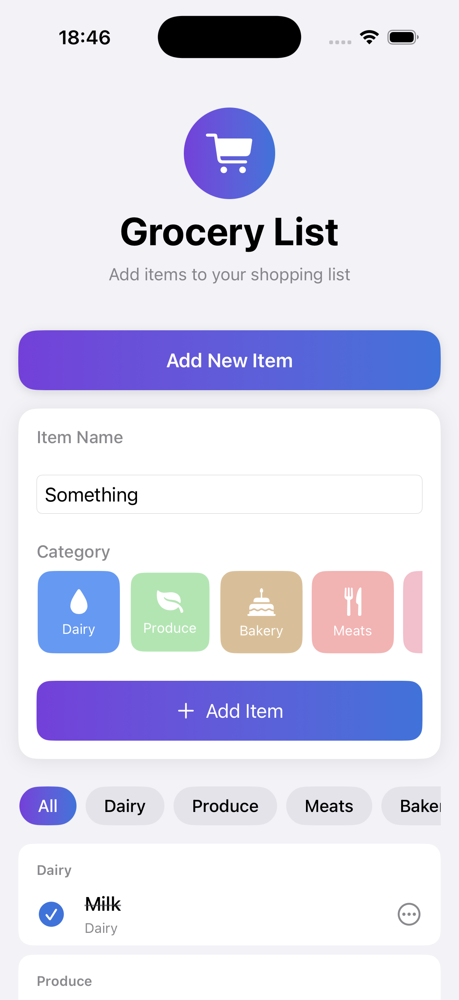
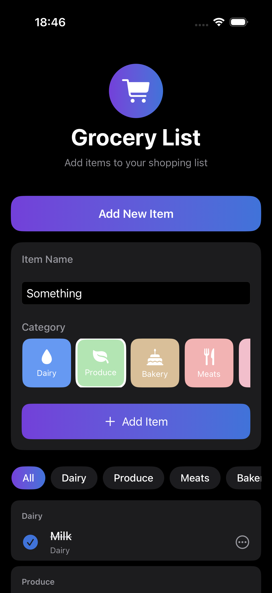

# PFListy

A SwiftUI grocery list app for iOS. Add items by category, filter by category, and mark items as purchased.

| Light Mode | Dark Mode |
|:----------:|:---------:|
|  |  |

## Running the App

1. Open `PFListy.xcodeproj` in Xcode.
2. Select a simulator or device.
3. Press **⌘R** to build and run.

**Requirements:** iOS 17.6+

## Architecture

### MVVM

The app uses **Model–View–ViewModel (MVVM)**:

- **Model:** `ListItemModel` and `ListItemCategory` in the Domain layer.
- **View:** SwiftUI views (`GroceryListView`, `AddItemDrawerView`, etc.) that observe the ViewModel.
- **ViewModel:** `GroceryListViewModel` holds state and business logic, exposes `@Published` properties for the UI.

Views bind to the ViewModel via `@ObservedObject` and never access data or repositories directly.

### Repository Pattern

Data access is abstracted behind `ListItemRepositoryProtocol`

The ViewModel depends on the protocol, not concrete implementations. This enables:

- **Testability:** Unit tests inject a mock that can simulate errors.
- **Previews:** SwiftUI previews use an in-memory mock (no Core Data).

### Dependency Injection

`GroceryListFactory` creates the feature with injected dependencies:

- **Production:** Uses `CoreDataListItemRepository` with the app’s `NSManagedObjectContext`.
- **Previews:** Uses `MockListItemRepository` with sample data.

The coordinator gets the context from the environment and passes it into the factory.

### Testing

Unit tests live in `PFListyTests/` and target `GroceryListViewModel` using a mock repository that can throw errors. Run tests with **⌘U**.
